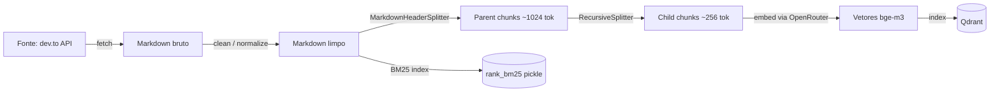
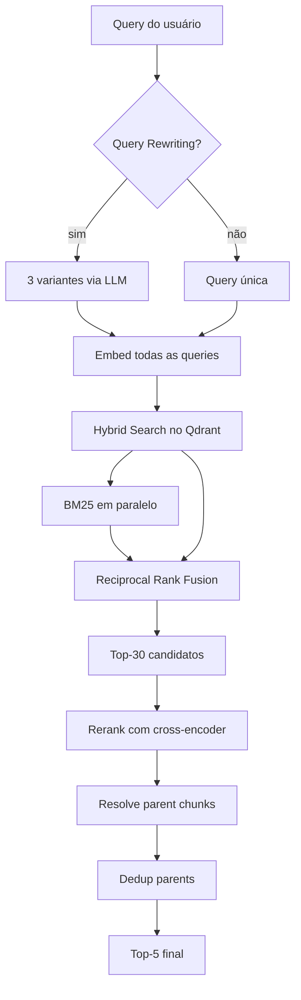

---
tags:
  - planning
  - documentation
  - embeddings
  - chunking
  - nlp
  - llm
---

# PRD — Semantic Document Search

- **Projeto:** Semantic Document Search
- **Status:** Planejamento

Segue as [[../CONVENTIONS|Engineering Conventions]] e reaproveita o padrão `app/ai/` estabelecido em [[../virtual-library-api/PRD|Virtual Library API]].

---

## 1. Contexto e Objetivo

Sistema de busca semântica de documentos com foco em **qualidade de retrieval** — vai além de "indexar e fazer cosine similarity". Demonstra domínio de decisões arquiteturais e trade-offs reais em sistemas RAG de produção: parsing, chunking, metadata, hybrid search, reranking e avaliação quantitativa.

### 1.1 Objetivo

Entregar um sistema de **busca semântica de produção** focado em **qualidade de retrieval**, não apenas "funciona". Cada decisão técnica é justificada por um ADR e mensurada via eval framework com métricas padrão de IR (recall@k, MRR, NDCG).

### 1.2 Escopo técnico elevado

Este é o projeto de maior densidade técnica do portfólio porque RAG moderno é onde backend encontra IA. As decisões de qualidade (seção 3) são o diferencial — não é só "qual vector store escolheu", é "como garantiu que o retrieval funciona bem em casos reais".

---

## 2. Escopo

### 2.1 Requisitos Core

- [x] Conjunto de documentos (artigos/posts)
- [x] Gerar embeddings com modelo de embeddings
- [x] Armazenar em vector store
- [x] Função de busca retornando documentos mais relevantes por similaridade semântica
- [x] Exemplos de consultas demonstrando funcionamento

### 2.2 Diferenciais — centro do projeto

**Decisões de qualidade RAG** (detalhadas na seção 3):

- [x] **Parsing para Markdown antes do chunking** — preserva estrutura semântica do documento
- [x] **Chunking semântico** baseado em headers, não em caracteres
- [x] **Chunk size + overlap empiricamente justificados** (ADR documentando escolha)
- [x] **Qdrant como vector store** — metadata filtering nativo, hybrid search, deploy em cloud
- [x] **Metadata schema rico** — source, title, section heading path, author, date, tags, chunk_index, parent_doc_id
- [x] **Hybrid search** (BM25 + dense) com score fusion (Reciprocal Rank Fusion)
- [x] **Reranking** com cross-encoder após retrieval inicial
- [x] **Parent-child retrieval** (chunk pequeno pra match, parent grande pra contexto)
- [x] **Eval framework** — conjunto de queries de teste + métricas (recall@k, MRR)
- [x] **Query rewriting** opcional via LLM (expande query em 3 variantes)

**Decisões arquiteturais que sobem a régua** (elevados em relação ao Q1):

- [x] **Package-by-feature** — `app/ingestion/`, `app/retrieval/`, `app/evaluation/`, `app/shared/`. Cada pipeline self-contained; código cross-feature vive em `shared/`
- [x] **Finite State Machine na ingestão** (`transitions` lib) — states: `pending → fetching → parsing → chunking → embedding → indexing → completed`, com `failed` como estado terminal retomável. Transições inválidas impossíveis por construção. Graphviz export automático pra docs
- [x] **Functional Pipeline na retrieval** — stages compostos (`QueryRewriter`, `DenseSearch`, `SparseSearch`, `RRFFusion`, `Reranker`, `ParentResolver`) com graceful degradation por stage (rerank falha → volta pro hybrid_score)
- [x] **Idempotência na ingestão via hash** — ingerir a mesma URL 2x faz upsert determinístico, não duplica chunks
- [x] **Collection versioning no Qdrant** — nome `documents_{embedding_model}_v{n}` — trocar modelo = nova collection limpa, zero pollution
- [x] **Repository pattern pro Qdrant** — wrap `qdrant-client` em interface própria (mockável em testes, trocável por Milvus/Weaviate)
- [x] **Job persistence em SQLite** — tabela `ingest_jobs` com histórico de transições; jobs sobrevivem restart do container
- [x] **Config validation no boot** — `Settings.model_post_init` checa alcançabilidade do Qdrant; falha cedo vs no primeiro request
- [x] **Observabilidade por stage** — logs estruturados com `stage=parse|chunk|embed|index` + `duration_ms`; timeline completa por job via `/ingest/jobs/{id}`

**Infra:**
- [x] FastAPI expondo a busca (mesmo padrão Q1)
- [x] Notebook Jupyter demonstrando o pipeline (didática)
- [x] Deploy público + Qdrant Cloud

### 2.3 Fora do escopo

- Indexação contínua em tempo real (pipeline batch é suficiente)
- Multi-tenancy
- Autenticação
- Filtros por usuário

---

## 3. Decisões de Qualidade RAG (centro do projeto)

Esta seção é o coração do PRD. Cada decisão vira um ADR.

### 3.1 Parsing para Markdown primeiro

**Problema:** chunking baseado em HTML cru ou texto puro perde estrutura semântica. Um chunk pode cortar no meio de uma seção, misturando contextos.

**Decisão:** converter TODO documento de entrada para **Markdown limpo** antes de qualquer processamento.

**Benefício:**
- Headers (`#`, `##`, `###`) viram **fronteiras naturais** de seção
- Listas, tabelas e code blocks preservam delimitadores
- Chunking semântico fica trivial (quebra em headers)
- Consistência entre fontes heterogêneas (HTML, PDF, DOCX → tudo markdown)

**Ferramentas candidatas:**
- **`docling`** (IBM, SOTA atual) — parse rico de PDFs + HTML + preserva layout → markdown
- `marker` — PDF→markdown focado em papers
- `MarkItDown` (Microsoft) — conversor unificado
- `unstructured.io` — popular mas menos preciso

**Escolha:** `docling` para PDFs; `html2text` ou `markdownify` para HTML (dev.to já serve markdown via API — pular etapa).

**ADR:** `001-parse-to-markdown-for-semantic-chunking.md`

### 3.2 Chunking semântico em headers

**Problema:** chunking fixo por caracteres corta frases/parágrafos no meio. Resultado: chunks incoerentes, embeddings ruins, retrieval ruim.

**Decisão:** chunking em **duas camadas**:

1. **Split primário por `##` e `###`** — cada seção vira um chunk "parent"
2. **Re-split secundário** se o chunk parent for > N tokens — divide em sub-chunks preservando o heading do pai

Implementação via `langchain.text_splitter.MarkdownHeaderTextSplitter` + `RecursiveCharacterTextSplitter` em pipeline.

**ADR:** `002-hierarchical-semantic-chunking.md`

### 3.3 Chunk size e overlap

**Problema:** tamanho errado quebra qualidade. Muito pequeno → perde contexto. Muito grande → dilui matching.

**Decisão:**
- **Chunk size:** **512 tokens** (considerando ~400 palavras)
- **Overlap:** **64 tokens** (~12.5%)

**Justificativa:**
- 512 é o sweet spot empírico em literatura RAG moderna para embeddings de uso geral
- `bge-m3` suporta até 8192, mas chunks grandes diluem sinal em cosine similarity
- Overlap de 12.5% garante que frases cortadas no limite apareçam em ambos os chunks adjacentes
- Alinhado com `sentence-transformers` defaults da comunidade

**Fallback:** permitir `CHUNK_SIZE` e `CHUNK_OVERLAP` como env vars para experimentação.

**ADR:** `003-chunk-size-and-overlap.md`

### 3.4 Metadata schema

Cada chunk no Qdrant carrega payload rico:

```json
{
  "source_url": "https://dev.to/author/post-slug",
  "source_type": "blog_post",
  "title": "Building RAG with Qdrant",
  "author": "jane_doe",
  "published_at": "2025-11-20T14:30:00Z",
  "tags": ["python", "rag", "qdrant"],
  "section_path": ["Introduction", "Why Qdrant"],
  "chunk_index": 3,
  "chunk_total": 12,
  "parent_doc_id": "post_abc123",
  "parent_chunk_id": "post_abc123_section_2",
  "char_count": 2048,
  "token_count": 487,
  "indexed_at": "2026-04-18T10:00:00Z",
  "embedding_model": "baai/bge-m3"
}
```

**Por quê essa estrutura:**
- `section_path` permite filtro "só introduções" ou breadcrumb no resultado
- `parent_doc_id` e `parent_chunk_id` habilitam **parent-child retrieval** (retorna chunk pequeno no match, busca parent grande no Qdrant pra contexto)
- `tags` permite filtro combinado com busca semântica (filter + vector)
- `embedding_model` permite migração/invalidação se trocar modelo
- `token_count` ajuda em debug de relevância

**ADR:** `004-metadata-schema-design.md`

### 3.5 Qdrant collection config

```python
client.create_collection(
    collection_name="documents",
    vectors_config=VectorParams(
        size=1024,                    # bge-m3
        distance=Distance.COSINE,
    ),
    optimizers_config=OptimizersConfigDiff(
        indexing_threshold=10_000,    # cria HNSW só acima de 10k pontos
    ),
    hnsw_config=HnswConfigDiff(
        m=16,
        ef_construct=128,
    ),
    quantization_config=ScalarQuantization(   # compressão: 1/4 do storage
        scalar=ScalarQuantizationConfig(
            type=ScalarType.INT8,
            always_ram=True,
        ),
    ),
)
```

Justificativas documentadas em ADR: `005-qdrant-collection-config.md`

### 3.6 Hybrid Search (BM25 + Dense) com RRF

**Problema:** busca só dense perde matches lexicais específicos (nomes próprios, termos exatos, tokens raros). Busca só BM25 perde sinônimos e paráfrases.

**Decisão:** executar **ambas** as buscas e combinar com **Reciprocal Rank Fusion (RRF)**:

```
score_final(doc) = Σ_strategy  1 / (k + rank_strategy(doc))
```

Onde `k=60` (constante padrão em IR). RRF não depende da escala absoluta dos scores — funciona mesmo com BM25 e cosine tendo ranges diferentes.

**Implementação:**
- BM25 via `rank_bm25` em Python OU feature nativa do Qdrant (sparse vectors)
- Qdrant suporta hybrid search em uma única query desde v1.10+ via `prefetch` + `query`

**ADR:** `006-hybrid-search-with-rrf.md`

### 3.7 Reranking com cross-encoder

**Problema:** retrieval vetorial otimiza recall (top-100 quase sempre contém a resposta), mas precisão no top-K (top-5) pode ser ruim porque cosine de embedding ≠ relevância semântica refinada.

**Decisão:** pipeline de dois estágios:
1. Retrieval hybrid retorna top-30
2. Cross-encoder rerankeia e retorna top-5

**Modelo:** `BAAI/bge-reranker-v2-m3` via Hugging Face ou API gratuita. Alternativa: usar OpenRouter pra chamada LLM de reranking (mais caro).

**Trade-off:** adiciona ~200ms de latência. Aceitável para melhora de precisão@5 em 15-25% típica.

**ADR:** `007-cross-encoder-reranking.md`

### 3.8 Parent-Child Retrieval

**Problema:** chunks pequenos ganham em precisão de matching mas pobres em contexto; chunks grandes têm contexto mas sinal diluído.

**Decisão:** indexar **chunks filhos** (~256 tokens) com `parent_chunk_id` apontando para **chunks pais** (~1024 tokens). No retrieval:
1. Busca nos filhos (precisão)
2. Resolve para parents (contexto)
3. Deduplica parents (múltiplos filhos podem apontar pro mesmo parent)

**Benefício:** best of both worlds. Técnica padrão em RAG moderno (Advanced RAG, Building Production RAG).

**ADR:** `008-parent-child-retrieval.md`

### 3.9 Ingestion as Finite State Machine

**Problema:** pipeline de ingestão tem múltiplas etapas I/O-bound (fetch, parse, chunk, embed, index), cada uma passível de falha transiente. Tratar como loop linear (`try: step1; step2; step3`) perde:

- **Granularidade de retry** — falhar no embedding não deveria reprocessar parse+chunk
- **Observabilidade** — sem saber em que estágio está, debug vira arqueologia
- **Progresso parcial** — se Qdrant cai no indexing depois de 200 chunks computados, queremos retomar do indexing, não do zero
- **Correctness** — transições inválidas (skip de stages, loops) precisam ser impossíveis por construção, não por disciplina

**Decisão:** modelar a ingestão como FSM explícita usando a lib `transitions` (Python), com estados:

```
pending → fetching → parsing → chunking → embedding → indexing → completed
                                                                       ↑
                                                                   terminal
                        (qualquer stage)  →  failed  →  (retry) →  pending
```

Transições declarativas:

```python
# app/ingestion/state.py
from enum import StrEnum
from transitions import Machine

class JobState(StrEnum):
    PENDING, FETCHING, PARSING, CHUNKING = "pending", "fetching", "parsing", "chunking"
    EMBEDDING, INDEXING, COMPLETED, FAILED = "embedding", "indexing", "completed", "failed"

TRANSITIONS = [
    {"trigger": "start_fetch",  "source": JobState.PENDING,   "dest": JobState.FETCHING},
    {"trigger": "start_parse",  "source": JobState.FETCHING,  "dest": JobState.PARSING},
    {"trigger": "start_chunk",  "source": JobState.PARSING,   "dest": JobState.CHUNKING},
    {"trigger": "start_embed",  "source": JobState.CHUNKING,  "dest": JobState.EMBEDDING},
    {"trigger": "start_index",  "source": JobState.EMBEDDING, "dest": JobState.INDEXING},
    {"trigger": "complete",     "source": JobState.INDEXING,  "dest": JobState.COMPLETED},
    {"trigger": "fail",         "source": "*",                "dest": JobState.FAILED},
    {"trigger": "retry",        "source": JobState.FAILED,    "dest": JobState.PENDING},
]
```

**Benefícios concretos:**

1. **Graphviz auto-gerado** — `make diagram-states` exporta PNG do FSM atual; README nunca fica dessincronizado com código
2. **Callbacks on_enter/on_exit** — logs estruturados "de graça" (`stage=X duration_ms=Y job_id=Z`)
3. **Testes por transição** — `test_cannot_skip_from_fetching_to_indexing`, `test_any_state_can_fail`
4. **Persistência simples** — `{job_id, state, history, error}` em SQLite; `/ingest/jobs/{id}` mostra timeline completa

**ADR:** `012-fsm-for-ingestion-pipeline.md`

### 3.10 Retrieval as Functional Pipeline

**Problema:** retrieval é sequência de stages também, mas tem shape diferente da ingestão:

- **Sem estado persistente** — cada request é novo
- **Síncrono** — dataflow, não long-running
- **Stages opcionais com fallback** — se rerank falha, volta pro hybrid_score; não é "estado failed"

**Decisão:** padrão **Pipeline composable** em vez de FSM. Cada stage é função pura com input/output tipados; pipeline compõe e roda com graceful degradation:

```python
# app/retrieval/pipeline.py
class RetrievalPipeline:
    def __init__(self, stages: list[Stage]):
        self.stages = stages

    async def run(self, query: str) -> list[Result]:
        ctx = Context(query=query)
        for stage in self.stages:
            try:
                ctx = await stage.run(ctx)
            except StageError as e:
                if stage.optional:
                    logger.warning("stage.skipped", stage=stage.name, reason=str(e))
                    continue
                raise
        return ctx.results
```

Stages registrados: `QueryRewriter` (optional), `DenseSearch`, `SparseSearch`, `RRFFusion`, `Reranker` (optional), `ParentResolver`.

**ADR:** `013-pipeline-pattern-for-retrieval.md`

### 3.11 Engineering details (qualidade de implementação)

Detalhes que separam "funcional" de "pronto pra produção":

| Detalhe | Decisão | Implementação |
|---|---|---|
| **Idempotência** | Hash do source URL como `job_id`. Re-submit mesmo URL → upsert determinístico (mesmos chunk IDs). | `hashlib.sha256(url).hexdigest()[:16]` |
| **Collection versioning** | `documents_{model}_v{n}` — ao trocar modelo de embedding, cria nova collection + migration. Sem contaminação de dims diferentes. | Env: `QDRANT_COLLECTION_VERSION`, default `v1` |
| **Repository pattern pro Qdrant** | `shared/qdrant/repository.py` wrappeando `qdrant-client`. Services chamam interface própria; testes mockam. | `class VectorRepository(Protocol): ...` |
| **Job persistence em SQLite** | Tabela `ingest_jobs` com `id, state, source_url, error, created_at, updated_at` + `job_transitions(job_id, from_state, to_state, at)` | SQLAlchemy 2.0 como Q1 |
| **Config validation no boot** | `Settings.model_post_init` pinga Qdrant via `/collections`. Falha fast na subida do container se URL/key errada. | `pydantic-settings` hook |
| **Observabilidade estruturada** | `structlog.contextvars.bind_contextvars(job_id=..., stage=...)` em cada transição. Logs JSON em prod. | Reuso do `shared/core/logging.py` do Q1 |
| **Graceful degradation** | Rerank falha → fallback pro hybrid_score; sparse index stale → fallback pro dense only. Nunca 5xx por stage opcional. | `stage.optional = True` |

**ADR:** `014-engineering-details.md` (consolida os 7 pontos)

### 3.12 Evaluation framework

**Problema:** sem métricas, "melhorei o RAG" é subjetivo.

**Decisão:** criar conjunto de **~20 queries de teste** com documentos esperados como "golden set". Rodar pipeline e medir:

- **Recall@5** — % de vezes que o doc correto aparece no top-5
- **MRR (Mean Reciprocal Rank)** — posição média do primeiro doc correto
- **NDCG@10** — ganho cumulativo descontado (opcional)

Script CLI: `python -m app.eval` imprime tabela comparativa entre estratégias (dense only, hybrid, hybrid+rerank).

**Differencial forte** — mostra que você **mede**, não só constrói. ADR: `009-evaluation-framework.md`

---

## 4. Stack

| Camada | Escolha | Justificativa |
|---|---|---|
| **Framework web** | **FastAPI** | Consistência com Q1 |
| **Vector store** | **Qdrant Cloud** | Metadata filtering, hybrid search nativo, deploy em cloud grátis (1GB) |
| **Qdrant client** | `qdrant-client` | SDK oficial, suporta async |
| **LLM gateway** | **OpenRouter** | Consistência com Q1 e Q2 |
| **Embedding model** | `baai/bge-m3` (via OpenRouter) | Multilíngue SOTA, 1024 dims, context 8192 |
| **Parsing** | `docling` (PDFs) + `markdownify` (HTML) | SOTA atual, preserva estrutura |
| **Chunking** | `langchain.text_splitter` (MarkdownHeader + Recursive) | Padrão, combinável |
| **Reranker** | `BAAI/bge-reranker-v2-m3` | Mesmo vendor do embedding, alinhado |
| **BM25** | `rank_bm25` em Python | Leve, ou Qdrant sparse vectors nativo |
| **State machine** | **`transitions`** | FSM declarativa p/ ingestão; callbacks + graphviz export |
| **Job persistence** | **SQLite + SQLAlchemy 2.0** | Jobs sobrevivem restart; mesmo stack do Q1 |
| **Notebook demo** | `jupyter` | Demo didática do pipeline |
| **Gerenciador de dep** | `uv` | Consistência |
| **Testes** | `pytest` + `schemathesis` | Consistência |
| **Deploy API** | Fly.io | Consistência |
| **Deploy Qdrant** | Qdrant Cloud (free tier) | Free tier suficiente |

---

## 5. Arquitetura

### 5.1 Pipeline de Ingestão



### 5.2 Pipeline de Retrieval



---

## 6. API Design

### 6.1 Endpoints

| Método | Rota | Descrição |
|---|---|---|
| `POST` | `/ingest` | Ingere lista de URLs (dev.to API) — assíncrono |
| `GET` | `/ingest/status/{job_id}` | Status da ingestão |
| `GET` | `/search` | Busca semântica com filtros |
| `GET` | `/documents/{id}` | Recupera chunk/parent por ID |
| `GET` | `/collections/stats` | Estatísticas (total de chunks, modelos, etc) |
| `GET` | `/health` | Healthcheck (conexão Qdrant + versão) |

### 6.2 Query params em `GET /search`

- `q` (str, obrigatório) — texto da busca
- `top_k` (int, default 5, max 20)
- `strategy` (enum, default `hybrid_rerank`) — `dense`, `bm25`, `hybrid`, `hybrid_rerank`
- `rewrite_query` (bool, default false) — ativa query rewriting via LLM
- `tags` (list[str], opcional) — filtro por tag
- `source_type` (str, opcional) — filtro por tipo de fonte
- `min_score` (float, opcional)

### 6.3 Response

```json
{
  "query": "como fazer chunking em rag",
  "strategy": "hybrid_rerank",
  "results": [
    {
      "score": 0.892,
      "rerank_score": 0.94,
      "chunk_id": "post_abc_chunk_03",
      "parent_chunk_id": "post_abc_section_2",
      "content": "Chunking é o processo de...",
      "parent_content": "## Chunking em RAG\n\nChunking é o processo de...",
      "metadata": { ... },
      "highlights": ["chunking", "rag"]
    }
  ],
  "total_candidates_scanned": 30,
  "elapsed_ms": 412
}
```

---

## 7. Estrutura de Pastas (package-by-feature)

Cada feature é self-contained com seu próprio router/service/schemas. Código genuinamente cross-feature vive em `shared/`. Esta organização difere do Q1 (package-by-layer) e **é consciente** — ver ADR-008.

```
semantic-document-search/
├── app/
│   ├── ingestion/                    # docs INTO the store
│   │   ├── __init__.py
│   │   ├── state.py                  # FSM (transitions lib) + JobState enum
│   │   ├── models.py                 # SQLAlchemy: IngestJob, JobTransition
│   │   ├── repository.py             # CRUD de jobs no SQLite
│   │   ├── parser.py                 # dev.to fetch + html→markdown
│   │   ├── chunker.py                # MarkdownHeader + Recursive splitters
│   │   ├── indexer.py                # Qdrant upsert + BM25 index maintenance
│   │   ├── service.py                # orquestra FSM: start_fetch → parse → chunk → embed → index
│   │   ├── router.py                 # POST /ingest, GET /ingest/jobs, GET /ingest/jobs/{id}
│   │   └── schemas.py                # IngestRequest, IngestJobRead, JobState
│   │
│   ├── retrieval/                    # docs OUT of the store
│   │   ├── __init__.py
│   │   ├── pipeline.py               # Pipeline + Stage abstrações
│   │   ├── context.py                # Context (query, candidates, results) passed through stages
│   │   ├── stages/
│   │   │   ├── __init__.py
│   │   │   ├── query_rewriter.py     # optional: LLM expand into variants
│   │   │   ├── dense.py              # dense search via Qdrant
│   │   │   ├── sparse.py             # BM25 search
│   │   │   ├── fusion.py             # Reciprocal Rank Fusion
│   │   │   ├── reranker.py           # optional: cross-encoder rerank
│   │   │   └── parent_child.py       # resolve parents + dedup
│   │   ├── service.py                # monta pipeline conforme strategy
│   │   ├── router.py                 # GET /search
│   │   └── schemas.py                # SearchRequest, SearchResult, SearchResponse
│   │
│   ├── evaluation/                   # golden set + metrics runner
│   │   ├── __init__.py
│   │   ├── queries.yaml              # 20+ golden queries com expected docs
│   │   ├── metrics.py                # recall@k, MRR, NDCG
│   │   ├── runner.py                 # CLI: python -m app.evaluation.runner
│   │   └── schemas.py                # GoldenQuery, EvalReport
│   │
│   ├── shared/                       # genuinamente cross-feature
│   │   ├── __init__.py
│   │   ├── ai/
│   │   │   ├── client.py             # OpenRouter (literal copy do Q1)
│   │   │   └── embeddings.py         # generate_embedding (bge-m3)
│   │   ├── qdrant/
│   │   │   ├── client.py             # factory, health check
│   │   │   ├── repository.py         # VectorRepository protocol + QdrantRepository impl
│   │   │   └── collections.py        # create/migrate collection com versioning
│   │   ├── db/
│   │   │   ├── __init__.py
│   │   │   ├── database.py           # SQLAlchemy engine, SessionLocal, get_db (Q1 pattern)
│   │   │   └── base.py               # Base declarative
│   │   ├── core/
│   │   │   ├── exceptions.py         # RFC 7807 handlers (reused Q1)
│   │   │   └── logging.py            # structlog + request_id (reused Q1)
│   │   ├── api/
│   │   │   ├── deps.py               # DbDep, QdrantDep, IngestionServiceDep, RetrievalServiceDep
│   │   │   └── routers/health.py
│   │   └── schemas/
│   │       └── problem.py            # RFC 7807 Problem model (reused Q1)
│   │
│   ├── config.py                     # Settings com model_post_init (boot-time validation)
│   ├── main.py                       # assembles app, registra routers por feature
│   └── static/
│       └── index.html                # landing page
│
├── alembic/                          # migrations pro SQLite (ingest_jobs)
│   └── versions/
├── notebooks/
│   └── pipeline-demo.ipynb           # demo didática end-to-end
│
├── tests/                            # espelha package-by-feature
│   ├── ingestion/
│   │   ├── test_state_machine.py
│   │   ├── test_parser.py
│   │   ├── test_chunker.py
│   │   ├── test_indexer.py
│   │   ├── test_service.py
│   │   └── test_router.py
│   ├── retrieval/
│   │   ├── test_pipeline.py
│   │   ├── test_stages.py
│   │   ├── test_service.py
│   │   └── test_router.py
│   ├── evaluation/
│   │   ├── test_metrics.py
│   │   └── test_runner.py
│   ├── shared/
│   │   ├── test_qdrant_repository.py
│   │   └── test_ai_client.py
│   └── conftest.py
│
├── docs/
│   ├── adr/
│   │   ├── 001-parse-to-markdown-for-semantic-chunking.md
│   │   ├── 002-hierarchical-semantic-chunking.md
│   │   ├── 003-chunk-size-and-overlap.md
│   │   ├── 004-metadata-schema-design.md
│   │   ├── 005-qdrant-collection-config.md
│   │   ├── 006-hybrid-search-with-rrf.md
│   │   ├── 007-cross-encoder-reranking.md
│   │   ├── 008-package-by-feature.md               # NEW — justifica divergência vs Q1
│   │   ├── 009-parent-child-retrieval.md
│   │   ├── 010-evaluation-framework.md
│   │   ├── 011-openrouter-unified-llm-gateway.md
│   │   ├── 012-fsm-for-ingestion-pipeline.md       # NEW — FSM via transitions lib
│   │   ├── 013-pipeline-pattern-for-retrieval.md   # NEW — por que não FSM aqui
│   │   └── 014-engineering-details.md              # NEW — idempotência, versioning, etc
│   └── diagrams/
│       ├── architecture.md           # package-by-feature layered view
│       ├── ingestion-fsm.md          # state diagram (auto-gerado via transitions.get_graph)
│       └── retrieval-pipeline.md     # dataflow stages
│
├── .github/workflows/ (ci.yml, deploy.yml)
├── .devcontainer/
├── .env.example
├── Dockerfile                        # multi-stage (Q1 pattern)
├── docker-compose.yml                # local: Qdrant container
├── fly.toml
├── pyproject.toml                    # adiciona transitions, rank-bm25, qdrant-client
├── uv.lock
├── Makefile                          # + target diagram-states pra graphviz
├── README.md
└── docs/PRD.md
```

---

## 8. Corpus de Demo

**Escolha default:** posts técnicos do [dev.to](https://dev.to) via API pública (`https://dev.to/api/articles`).

**Por quê:**
- API oficial, sem scraping
- Markdown já limpo (campo `body_markdown`)
- Metadata rica (tags, autor, data)
- Conteúdo técnico variado (Python, AI, backend) — corpus tematicamente coeso
- Fácil de expandir (filtrar por tag)

**Seed inicial:** 50-100 posts com tags `python`, `rag`, `ai`, `backend`.

**Alternativa considerada:** Wikipedia PT (curado, mas tema muito amplo) — rejeitada em favor de corpus tematicamente coeso.

---

## 9. Roadmap — 5-6h

Fases maiores (cada fase = 1-2 PRs seguindo o workflow Q1: branch → commits atômicos → CI verde → Copilot review → squash merge).

### Fase 0 — Scaffold (30min)
- Copy tooling do Q1: `pyproject.toml`, `Makefile`, `Dockerfile`, `.dockerignore`, `.gitignore`, `.env.example`, `LICENSE`, `.editorconfig`, `.pre-commit-config.yaml`, `.devcontainer/`
- Copy CI workflow + `.github/copilot-instructions.md` (adaptado pro domínio RAG)
- Estrutura `app/` package-by-feature vazia com `__init__.py`
- `shared/` — copy literal de `ai/client.py`, `core/logging.py`, `core/exceptions.py`, `schemas/problem.py`, `api/routers/health.py` do Q1
- `config.py` + `main.py` mínimos
- `GitHub repo create` + deploy inicial no Fly.io (vazio) pra validar pipeline
- **Tag `v0.0.1` — scaffold live**

### Fase 1 — Ingestão com FSM (~2h)
- `ingestion/state.py` — FSM com `transitions` lib + JobState enum
- `ingestion/models.py` + alembic migration pra `ingest_jobs` + `job_transitions`
- `ingestion/repository.py` — CRUD SQLite
- `ingestion/parser.py` — dev.to API fetcher + markdown normalizer
- `ingestion/chunker.py` — hierárquico (MarkdownHeader + Recursive)
- `shared/qdrant/client.py` + `collections.py` + `repository.py` (interface + impl)
- `ingestion/indexer.py` — upsert chunks + BM25 index rebuild
- `ingestion/service.py` — orquestra FSM (start_fetch → start_parse → ... → complete)
- `ingestion/router.py` — POST /ingest (202 async), GET /ingest/jobs/{id}
- Testes de transições + idempotência
- **Tag `v0.1.0` — MVP ingestion funcional**

### Fase 2 — Retrieval com Pipeline (~1h30)
- `retrieval/pipeline.py` + `context.py` — abstrações genéricas
- `retrieval/stages/dense.py`, `sparse.py`, `fusion.py` (RRF) — core happy path
- `retrieval/stages/reranker.py` — cross-encoder (optional stage)
- `retrieval/stages/query_rewriter.py` — LLM expand (optional stage)
- `retrieval/stages/parent_child.py` — resolve + dedup
- `retrieval/service.py` — monta pipeline conforme `strategy` query param
- `retrieval/router.py` — GET /search
- Testes: pipeline composition, graceful degradation, stages individualmente
- **Tag `v0.2.0` — retrieval completo**

### Fase 3 — Eval + notebook demo (~1h)
- `evaluation/queries.yaml` — 20 golden queries curadas à mão
- `evaluation/metrics.py` — recall@k, MRR, NDCG
- `evaluation/runner.py` — CLI que roda pipeline contra golden set e imprime tabela comparativa por strategy
- `notebooks/pipeline-demo.ipynb` — demo didática end-to-end
- **README ganha a tabela de eval scores**

### Fase 4 — Deploy + Docs (~1h30)
- Fly.io config (reutiliza pattern Q1) + Qdrant Cloud secret
- CD workflow
- Rodar ingestão de 50-100 dev.to posts em prod
- Rodar eval contra prod; snapshot da tabela
- 14 ADRs (7 mantidos do PRD original + 7 novos: package-by-feature, FSM, Pipeline, engineering-details, etc)
- Mermaid diagrams (architecture + ingestion FSM + retrieval pipeline)
- README polido com badges, curl examples, eval table, screenshots
- **Tag `v1.0.0` + GitHub release**

---

## 10. Eval Framework — detalhe

### 10.1 Golden set (`app/eval/queries.yaml`)

```yaml
- query: "como fazer chunking em sistemas RAG"
  expected_doc_ids: ["post_rag_chunking_basics", "post_langchain_chunking"]
  expected_tags: ["rag", "chunking"]
  min_recall_at_5: 1.0
- query: "diferença entre bm25 e dense retrieval"
  expected_doc_ids: ["post_hybrid_search_guide"]
  min_recall_at_5: 1.0
# ... 18 more
```

### 10.2 Métricas calculadas

| Métrica | Fórmula | Alvo |
|---|---|---|
| Recall@5 | \|retrieved ∩ expected\| / \|expected\| | ≥ 0.85 |
| MRR | mean(1/rank_primeiro_correto) | ≥ 0.70 |
| NDCG@10 | padrão IR | ≥ 0.80 |

### 10.3 Output

```
Strategy              Recall@5   MRR      NDCG@10   Avg Latency
dense_only            0.65       0.52     0.68      142ms
bm25_only             0.55       0.48     0.61      38ms
hybrid_rrf            0.80       0.71     0.79      186ms
hybrid_rrf_rerank     0.90       0.84     0.88      421ms  ← default
```

Esta tabela **vai para o README** — sinal técnico forte.

---

## 11. Riscos

| Risco | Mitigação |
|---|---|
| Docling lento pra PDF (não usado aqui, mas em stretch) | dev.to API já serve markdown — evita parsing pesado |
| Qdrant Cloud free tier insuficiente | 1GB cabe facilmente 10k chunks; fallback para Qdrant local via docker-compose |
| Reranker model download lento no deploy | Pré-baixar no build do Dockerfile |
| Eval sem ground truth real | Construir ground truth manualmente baseado nos posts ingeridos; é subjetivo mas defensável |
| Hybrid search nativo do Qdrant com bug em versão nova | Fallback: dense + BM25 separado, fusion em Python |
| Escopo de 10 ADRs estoura tempo | Priorizar: escrever 5-6 no Dia 2; restantes como follow-up posterior |

---

## 12. Checklist Final

**Core:**
- [ ] Documentos indexados e busca semântica funcionando
- [ ] Notebook demonstrando pipeline
- [ ] Exemplos de consultas com resultados relevantes

**Diferenciais:**
- [ ] CI verde
- [ ] API deployada + Qdrant Cloud conectado
- [ ] Eval framework rodando (tabela no README)
- [ ] 10 ADRs escritos
- [ ] Mermaid diagrams (ingestão + retrieval)
- [ ] Parent-child retrieval funcionando
- [ ] Hybrid search + rerank ativados por default
- [ ] Notebook rodável (Google Colab compatible)
- [ ] Mesmo padrão `app/ai/` dos outros 2 repos
