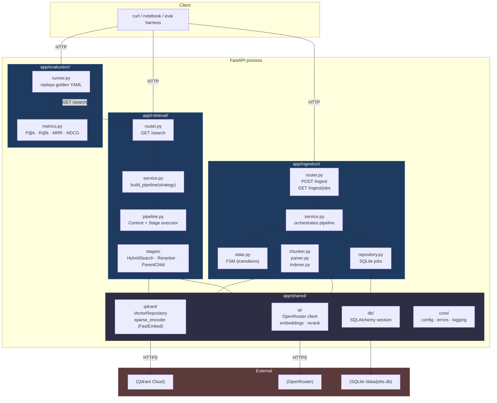

# Architecture — package-by-feature

Three top-level features (`ingestion/`, `retrieval/`, `evaluation/`) sit alongside `shared/` for genuinely cross-cutting code. Each feature owns its own `router`, `service`, `schemas`, and (where relevant) `repository` — features never reach into another feature's internals.

## How to read this

- **Vertical layering inside each feature is allowed** (`router → service → repository`), but every arrow stops at the feature boundary unless it goes through `shared/`.
- **`shared/` is small on purpose.** Anything that lives there is used by ≥ 2 features. The OpenRouter client, the Qdrant repository, the DB session, and the config / error / logging primitives all qualify. Source-specific code (the dev.to fetcher, the markdown parser) does *not* — that lives inside the feature that uses it.
- **The eval harness talks to the live HTTP surface, not the service layer.** That's deliberate (ADR-013): the numbers in `docs/eval-results-prod.txt` reflect end-to-end behaviour including FastAPI middleware, error handlers, and serialization — not just the algorithm.
- **External boxes** are the only out-of-process dependencies: Qdrant Cloud (vector store), OpenRouter (LLM gateway), and a Fly volume-mounted SQLite file (job persistence).
- ADR-001 explains the package-by-feature choice; ADR-011 explains why Qdrant access is wrapped in a Protocol; ADR-013 explains the per-stage degradation that's invisible in this diagram but lives in the `Pipeline` executor.
