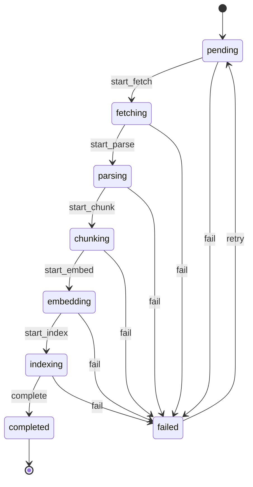

# Ingestion FSM

The state machine declared in [`app/ingestion/state.py`](../../app/ingestion/state.py). `transitions` enforces every edge below — illegal transitions raise `MachineError` (verified in `tests/ingestion/test_state_machine.py`).

## Notes

- **`completed` is absorbing.** The only way out is to spawn a new job (a new URL, or a re-ingest under a fresh `job_id`). ADR-010 covers idempotency.
- **`failed` is retomable.** `trigger=retry` cycles back to `pending` instead of inventing a new state — the transition log preserves the failure context.
- **Every transition writes a row** to `job_transitions` before the parent's `state` column is updated. `GET /ingest/jobs/{id}` returns the full timeline; the demo notebook renders it as a DataFrame.
- **Auto-generated PNG** version of this diagram lives next to it as `ingestion-fsm.png`, regenerated by `make diagram-states` from the same source declaration. The Mermaid here is for GitHub rendering; the PNG is what slides / external docs embed.

ADR-002 explains why we picked `transitions` over a hand-rolled state field.
