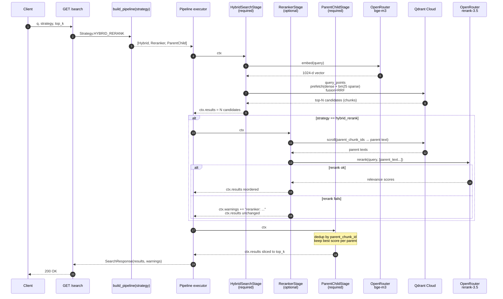

# Retrieval pipeline — sequence by strategy

`build_pipeline(strategy)` composes a sequence of `Stage`s. The same `Context` flows through every stage; each one mutates `ctx.results` and may add to `ctx.warnings`. Optional stages skip on error (ADR-013) — required stages propagate.

## Strategies — what's in / out

| Strategy | Stages (in order) |
|---|---|
| `dense_only` | `HybridSearchStage(sparse_enabled=False)` → `ParentChildStage` |
| `hybrid` | `HybridSearchStage` → `ParentChildStage` |
| `hybrid_rerank` | `HybridSearchStage` → `RerankerStage` → `ParentChildStage` |

## Why this shape

- **One round-trip for fusion (step 6).** Qdrant's Query API does dense + sparse + RRF server-side — we don't merge result lists in Python. ADR-007 explains the trade.
- **Reranker is optional (steps 9–14).** When OpenRouter rerank hiccups, the request still returns the unranked hybrid list with a warning. ADR-013 covers the degradation contract.
- **Rerank scores parent text, not children (step 9).** Cross-encoders are sensitive to surrounding context; the 256-token child often doesn't carry enough. The parent (≈1024 tokens) does. Hierarchical chunking (ADR-005) is what makes this clean.
- **Parent-child dedup runs last (step 16).** It works on whatever stage produced the most recent ranking — so for `hybrid_rerank`, dedup respects rerank scores rather than fusion scores.
